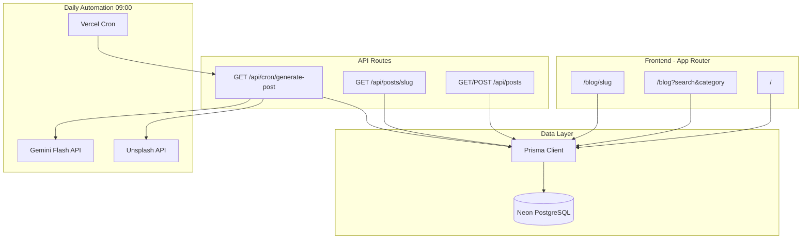

# Impact Stories — Implementation Plan

## Current State

The repo is a fresh [`create-next-app`](package.json) scaffold (Next.js 16.2, React 19, Tailwind v4, TypeScript). Only the default `/` route exists. All product requirements live in [`product.md`](product.md) and are unimplemented.

**Deployment target:** Vercel (with Vercel Cron + Neon PostgreSQL).

---

## Architecture



**Key design decisions:**
- **Pages use Prisma directly** in Server Components for fast SSR/SEO; API routes mirror the same query logic for the documented REST contract and future clients.
- **Blog content stored as Markdown** in `posts.content` — safer than raw HTML, easy for Gemini to produce, rendered with `react-markdown` + `remark-gfm`.
- **Search/filter via URL params** (`/blog?search=ai&category=Technology`) so results are shareable and SEO-friendly; client UI updates URL, server re-fetches.
- **Cron protected** with `CRON_SECRET` header (Vercel sets this automatically on cron invocations).
- **POST /api/posts** protected with a separate `API_SECRET` for manual/testing inserts.

---

## Phase 1 — Foundation & Database

### 1.1 Install dependencies

```bash
npm install @prisma/client @google/generative-ai react-markdown remark-gfm
npm install -D prisma
```

### 1.2 Folder structure

```
src/
  app/
    page.tsx                    # Home (hero + latest posts)
    blog/
      page.tsx                  # Listing + search/filter
      [slug]/page.tsx           # Detail page
    api/
      posts/route.ts            # GET (list/search/filter), POST (create)
      posts/[slug]/route.ts     # GET (single)
      cron/generate-post/route.ts
  components/
    layout/Header.tsx
    layout/Footer.tsx
    blog/PostCard.tsx
    blog/SearchBar.tsx
    blog/CategoryFilter.tsx
    blog/PostContent.tsx
    home/Hero.tsx
    home/LatestPosts.tsx
  lib/
    prisma.ts                   # Singleton Prisma client
    posts.ts                    # Shared query helpers
    categories.ts               # Category enum + labels
    gemini.ts                   # AI generation
    unsplash.ts                 # Image fetch
    slugify.ts                  # Slug utility
    auth.ts                     # CRON_SECRET / API_SECRET checks
prisma/
  schema.prisma
vercel.json                     # Cron schedule
.env.example
```

### 1.3 Prisma schema ([`prisma/schema.prisma`](prisma/schema.prisma))

```prisma
model Post {
  id              String   @id @default(cuid())
  title           String
  slug            String   @unique
  content         String   @db.Text
  metaDescription String   @map("meta_description") @db.VarChar(160)
  imageUrl        String   @map("image_url")
  imageAlt        String   @map("image_alt")
  author          String   @default("Wayan Phantom Megaditha")
  category        String
  createdAt       DateTime @default(now()) @map("created_at")
  publishedAt     DateTime @default(now()) @map("published_at")

  @@index([category])
  @@index([publishedAt(sort: Desc)])
  @@map("posts")
}
```

### 1.4 Environment variables ([`.env.example`](.env.example))

| Variable | Purpose |
|---|---|
| `DATABASE_URL` | Neon PostgreSQL connection string |
| `GEMINI_API_KEY` | Google AI Studio key |
| `GEMINI_MODEL` | e.g. `gemini-2.5-flash` (configurable; product spec says "Gemini 3.1 Flash") |
| `UNSPLASH_ACCESS_KEY` | Unsplash API search |
| `CRON_SECRET` | Vercel cron auth |
| `API_SECRET` | Protects POST /api/posts |
| `NEXT_PUBLIC_SITE_URL` | Canonical URLs for SEO metadata |

**Setup steps:** Create Neon project → copy connection string → run `npx prisma migrate dev`.

---

## Phase 2 — API Layer

Implement shared helpers in [`src/lib/posts.ts`](src/lib/posts.ts) used by both API routes and pages:

- `getPosts({ search?, category?, limit?, offset? })` — full-text search on `title` + `content` (Prisma `contains`, case-insensitive), optional category filter, ordered by `publishedAt desc`
- `getPostBySlug(slug)` — single post or null
- `createPost(data)` — insert with unique slug enforcement

### Endpoints

| Route | Method | Auth | Behavior |
|---|---|---|---|
| `/api/posts` | GET | Public | `?search=`, `?category=`, returns JSON array |
| `/api/posts` | POST | `API_SECRET` | Insert post (automation + manual) |
| `/api/posts/[slug]` | GET | Public | Single post JSON |
| `/api/cron/generate-post` | GET | `CRON_SECRET` | Full generation pipeline |

POST body shape matches the Prisma model fields. Return `409` on duplicate slug.

---

## Phase 3 — Frontend & Design System

### 3.1 Theme ([`src/app/globals.css`](src/app/globals.css))

Replace default zinc/dark-mode with a fixed **light white + blue** palette per product spec:

- Background: `#FFFFFF`
- Primary blue: `#2563EB` (buttons, links, accents)
- Text: `#1E293B` / muted `#64748B`
- Remove `prefers-color-scheme: dark` overrides

Update [`src/app/layout.tsx`](src/app/layout.tsx) with site metadata (`Impact Stories`, description, Open Graph defaults).

### 3.2 Shared layout

- **Header:** logo/title, nav links (Home, Blog)
- **Footer:** author credit, copyright

### 3.3 Pages

**Home [`src/app/page.tsx`](src/app/page.tsx)**
- Hero: headline about global impact stories, CTA to `/blog`
- Latest 3 posts grid (Server Component, Prisma query)
- Strong SEO: `generateMetadata()` with site-level title/description

**Blog listing [`src/app/blog/page.tsx`](src/app/blog/page.tsx)**
- Search bar + category pill/chip filter (8 categories from product spec)
- Post cards: title, excerpt (first ~160 chars of content), category badge, formatted date + time
- URL-driven state: `?search=&category=`
- Empty state when no results

**Blog detail [`src/app/blog/[slug]/page.tsx`](src/app/blog/[slug]/page.tsx)**
- `generateStaticParams()` for known slugs + `dynamicParams = true` for new posts
- `generateMetadata()` per post: title, metaDescription, OG image from `imageUrl`
- Display: title (H1), author, category, date + time (`publishedAt` formatted with `Intl.DateTimeFormat`), featured image (`next/image` with Unsplash domain in [`next.config.ts`](next.config.ts)), rendered Markdown body

### 3.4 Components

| Component | Responsibility |
|---|---|
| `PostCard` | Reusable card linking to `/blog/[slug]` |
| `SearchBar` | Controlled input, debounced URL update |
| `CategoryFilter` | Category chips from [`src/lib/categories.ts`](src/lib/categories.ts) |
| `PostContent` | `react-markdown` renderer with styled H2/H3/blockquote |

Categories (fixed list): AI, Technology, Sustainability, Tourism, Global Issues, Non-Profit, Future Jobs, World Economy.

---

## Phase 4 — AI Automation Pipeline

### 4.1 Gemini content generation ([`src/lib/gemini.ts`](src/lib/gemini.ts))

Prompt Gemini to return **structured JSON**:

```json
{
  "title": "...",
  "metaDescription": "...",
  "category": "AI",
  "content": "# Title\n\n## Section\n\n...",
  "imageAlt": "...",
  "imageQuery": "sustainability technology"
}
```

Prompt rules enforced in code:
- Professional, data-driven tone; one of the 8 topic areas
- Markdown with H1/H2/H3 hierarchy
- `metaDescription` truncated to 160 chars
- Author always set to **Wayan Phantom Megaditha** server-side (not trusted from AI)

### 4.2 Unsplash image ([`src/lib/unsplash.ts`](src/lib/unsplash.ts))

- Search by `imageQuery` from Gemini output
- Store **URL only** (`urls.regular`) + alt text — no image download/hosting
- Add `images.unsplash.com` to `next.config.ts` `images.remotePatterns`

### 4.3 Cron route ([`src/app/api/cron/generate-post/route.ts`](src/app/api/cron/generate-post/route.ts))

Daily pipeline:
1. Verify `CRON_SECRET`
2. Pick a topic/category (rotate or random from allowed list)
3. Call Gemini → parse JSON
4. Slugify title, ensure uniqueness (append `-2` suffix if needed)
5. Fetch Unsplash image
6. `createPost()` with `publishedAt = now()`
7. Return `{ success, slug }` or error details

### 4.4 Vercel Cron ([`vercel.json`](vercel.json))

```json
{
  "crons": [{
    "path": "/api/cron/generate-post",
    "schedule": "0 9 * * *"
  }]
}
```

Schedule is **09:00 UTC** by default; adjust if you want 09:00 WITA (UTC+8) → use `"0 1 * * *"`.

---

## Phase 5 — SEO, Seed Content & Deploy

### 5.1 SEO checklist

- Per-post `generateMetadata()` with title, description, OG tags
- JSON-LD `BlogPosting` schema on detail pages
- `sitemap.ts` auto-generated from all posts
- `robots.ts` allowing indexing
- Semantic HTML: single H1 per page, proper heading hierarchy in rendered content

### 5.2 Sample post

Two options (implement both):
1. **Prisma seed script** (`prisma/seed.ts`) — one hand-crafted sample post for immediate UI verification
2. **Dev trigger** — `curl` to `/api/cron/generate-post` with `CRON_SECRET` to test full AI pipeline locally

### 5.3 Deploy to Vercel

1. Push repo to GitHub
2. Import in Vercel, link Neon integration (auto-injects `DATABASE_URL`)
3. Add remaining env vars in Vercel dashboard
4. Run `prisma migrate deploy` via Vercel build command or post-deploy hook
5. Verify cron appears in Vercel → Settings → Cron Jobs

---

## Implementation Order

Build in this sequence to keep each step testable:

1. Prisma schema + migrate + seed sample post
2. `lib/posts.ts` query helpers
3. API routes (GET first, then POST)
4. Shared layout + theme tokens
5. Blog detail page (proves data → UI path)
6. Blog listing with search/filter
7. Home page hero + latest posts
8. Gemini + Unsplash libs
9. Cron route + `vercel.json`
10. SEO (metadata, sitemap, JSON-LD)
11. Deploy + test cron manually

---

## Risks & Mitigations

| Risk | Mitigation |
|---|---|
| Gemini returns invalid JSON | Retry once; validate with Zod schema before save |
| Duplicate slugs | Slug uniqueness check + numeric suffix |
| Unsplash rate limits / no results | Fallback to a default Unsplash URL for the category |
| Cron runs but post fails mid-pipeline | Return 500 so Vercel logs it; no partial DB writes (wrap in transaction) |
| Unsplash hotlinking blocked | Use Unsplash Source URLs; configure `next/image` remote patterns |

---

## Out of Scope (v1)

- Admin dashboard / CMS UI
- User comments or auth
- Image upload/hosting (URLs only per spec)
- Monetization / analytics (can add Vercel Analytics later)
- Multi-author support
